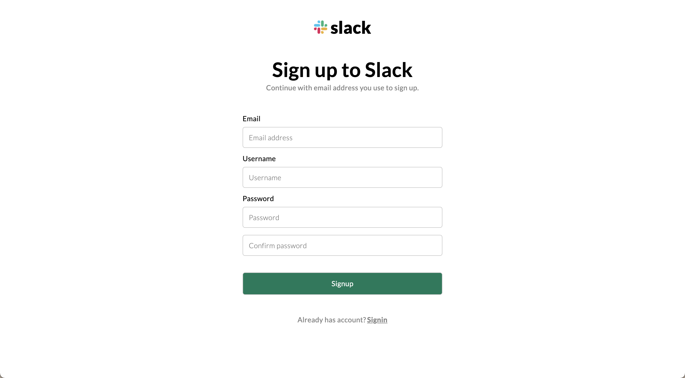
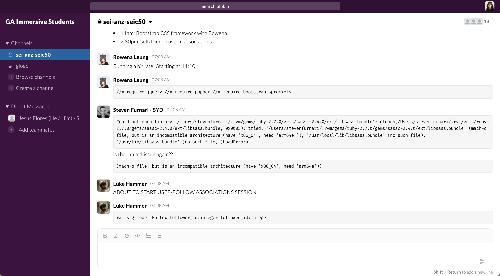
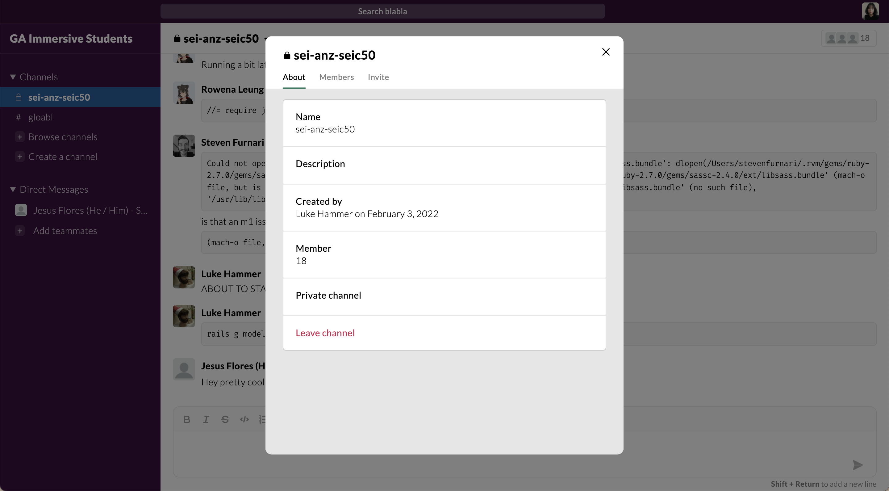
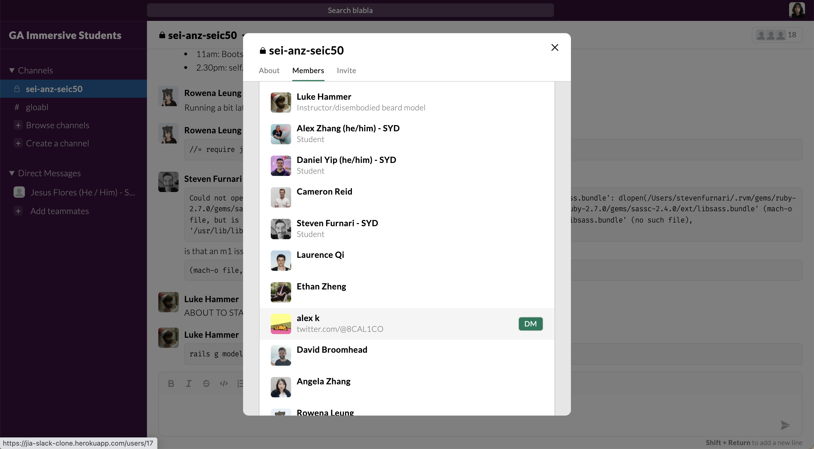
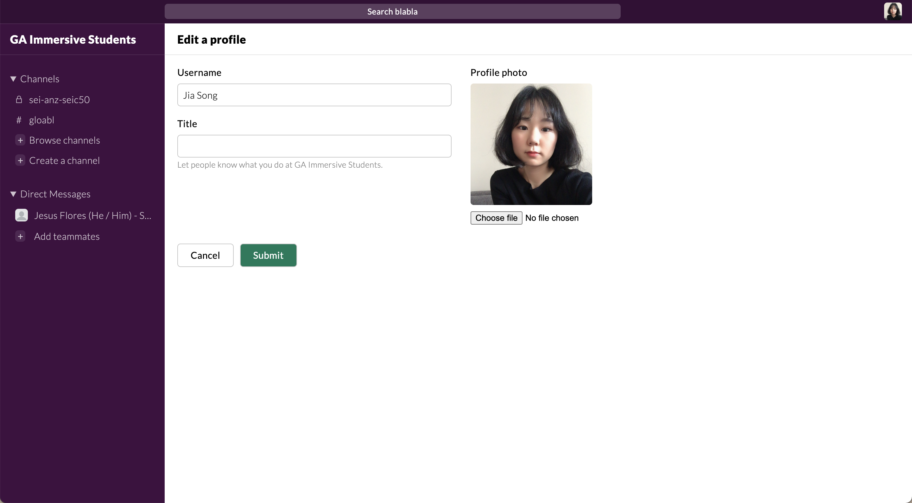

# Slack-clone

Slack clone built with Ruby on Rails.

**[Click here for demo](https://jia-slack-clone.herokuapp.com/)**

## Features

- CRUD for user, channel, and chat
- Join, invite, and leave channels
- Private/public channel options
- DM with other users

## Tech

- Ruby on Rails
- Sass
- Javascript

## Wishlist

- [ ] Prevent refresh when users write a chat.
- [ ] Build a real-time server.
- [ ] Push notification functionality.

## Screenshot

